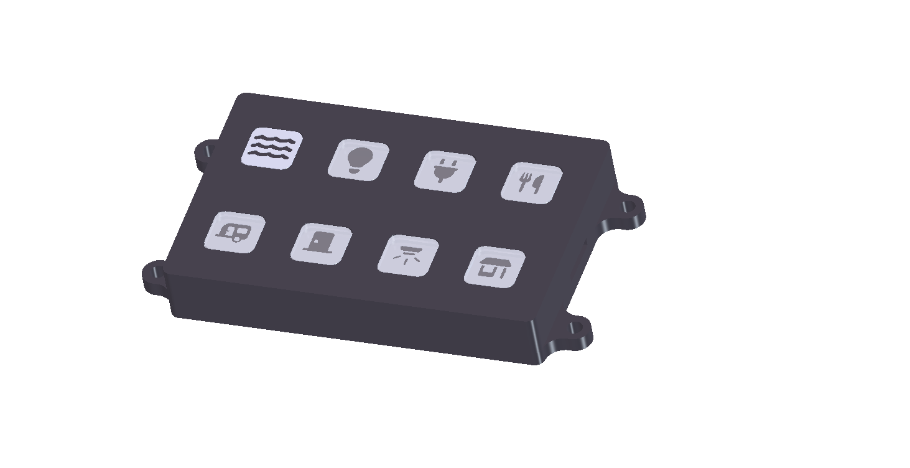

# TrailCurrent Tapper



Eight-button control panel that sends toggle commands over a CAN bus interface with OTA firmware update capability. Supports targeting Torrent (PWM lighting) or Switchback (relay) modules via build-time configuration. Part of the [TrailCurrent](https://trailcurrent.com) open-source vehicle platform.

## Hardware Overview

- **Microcontroller:** ESP32 (WROOM32)
- **Function:** Physical button panel for CAN bus device control
- **Key Features:**
  - 8 momentary buttons with LED backlights
  - Button press: toggle device on/off
  - Build-time target device selection (Torrent or Switchback, instance 0-2)
  - CAN bus communication at 500 kbps
  - Over-the-air (OTA) firmware updates via WiFi
  - mDNS-based network discovery
  - LED state feedback from CAN bus
  - FreeCAD enclosure design

## Hardware Requirements

### Components

- **Microcontroller:** ESP32 development board
- **CAN Transceiver:** Vehicle CAN bus interface (TX: GPIO 15, RX: GPIO 13)

### Pin Connections

**Buttons (INPUT_PULLUP):**

| GPIO | Function |
|------|----------|
| 34 | Button 1 |
| 25 | Button 2 |
| 27 | Button 3 |
| 12 | Button 4 |
| 16 | Button 5 |
| 22 | Button 6 |
| 21 | Button 7 |
| 18 | Button 8 |

**LED Backlights (OUTPUT):**

| GPIO | Function |
|------|----------|
| 32 | LED 1 |
| 33 | LED 2 |
| 26 | LED 3 |
| 14 | LED 4 |
| 4 | LED 5 |
| 23 | LED 6 |
| 19 | LED 7 |
| 17 | LED 8 |

### KiCAD Library Dependencies

This project uses the consolidated [TrailCurrentKiCADLibraries](https://github.com/trailcurrentoss/TrailCurrentKiCADLibraries).

**Setup:**

```bash
# Clone the library
git clone git@github.com:trailcurrentoss/TrailCurrentKiCADLibraries.git

# Set environment variables (add to ~/.bashrc or ~/.zshrc)
export TRAILCURRENT_SYMBOL_DIR="/path/to/TrailCurrentKiCADLibraries/symbols"
export TRAILCURRENT_FOOTPRINT_DIR="/path/to/TrailCurrentKiCADLibraries/footprints"
export TRAILCURRENT_3DMODEL_DIR="/path/to/TrailCurrentKiCADLibraries/3d_models"
```

See [KICAD_ENVIRONMENT_SETUP.md](https://github.com/trailcurrentoss/TrailCurrentKiCADLibraries/blob/main/KICAD_ENVIRONMENT_SETUP.md) in the library repository for detailed setup instructions.

## Opening the Project

1. **Set up environment variables** (see Library Dependencies above)
2. **Open KiCAD:**
   ```bash
   kicad EDA/trailcurrent-tapper.kicad_pro
   ```
3. **Verify libraries load** - All symbol and footprint libraries should resolve without errors
4. **View 3D models** - Open PCB and press `Alt+3` to view the 3D visualization

## Firmware

ESP-IDF based firmware in the `main/` directory.

**Prerequisites:**
- [ESP-IDF](https://docs.espressif.com/projects/esp-idf/en/stable/esp32/get-started/) v4.1 or later

**Build and flash:**
```bash
# Set up ESP-IDF environment
. $IDF_PATH/export.sh

# Build for Torrent instance 0 (default)
idf.py build

# Build for a specific target device and instance
idf.py build -DTARGET_DEVICE=switchback -DDEVICE_INSTANCE=2

# Flash via serial
idf.py -p /dev/ttyUSB0 flash monitor

# OTA update (after initial flash, with WiFi credentials provisioned)
curl -X POST http://esp32-XXYYZZ.local/ota --data-binary @build/tapper.bin
```

### Target Device Configuration

Each Tapper is built to target a specific device type and instance, set at compile time via CMake flags:

| Flag | Values | Default | Description |
|------|--------|---------|-------------|
| `TARGET_DEVICE` | `torrent`, `switchback` | `torrent` | Target device type |
| `DEVICE_INSTANCE` | `0`, `1`, `2` | `0` | Target device instance |

These flags determine the CAN IDs used for toggle commands and status feedback:

**Torrent (PWM lighting controller):**

| Instance | Toggle TX | Status RX | Status Format |
|----------|-----------|-----------|---------------|
| 0 | 0x18 | 0x1B | 8 bytes (one per channel, 0-255) |
| 1 | 0x19 | 0x1C | 8 bytes |
| 2 | 0x1A | 0x1D | 8 bytes |

**Switchback (relay module):**

| Instance | Toggle TX | Status RX | Status Format |
|----------|-----------|-----------|---------------|
| 0 | 0x25 | 0x28 | 1 byte (bitmask, one bit per relay) |
| 1 | 0x26 | 0x29 | 1 byte |
| 2 | 0x27 | 0x2A | 1 byte |

When switching between device types, run `idf.py fullclean` before rebuilding to clear cached CMake variables.

Multiple Tappers can target the same device instance — there is no limit.

### CAN Bus Protocol

**Transmit (Panel to Bus):**

| CAN ID | Bytes | Description |
|--------|-------|-------------|
| Torrent: 0x18-0x1A | 1 | Button toggle (byte 0 = button index 0-7) |
| Switchback: 0x25-0x27 | 1 | Button toggle (byte 0 = button index 0-7) |

**Receive (Bus to Panel):**

| CAN ID | Bytes | Description |
|--------|-------|-------------|
| 0x00 | 3 | OTA update trigger (MAC-based device targeting) |
| 0x01 | var | WiFi credential provisioning (chunked protocol) |
| 0x02 | 0 | Discovery trigger (broadcast) |
| Torrent: 0x1B-0x1D | 8 | LED state (1 byte per channel, 0=off, non-zero=on) |
| Switchback: 0x28-0x2A | 1 | LED state (bitmask, 1 bit per relay) |

### Button Behavior

- **Press**: Sends toggle command (debounced, 50ms). Byte 0 = button index (0-7).

### OTA Updates

WiFi credentials are provisioned over CAN (ID 0x01) and stored in NVS. When an OTA trigger (ID 0x00) matches this device's MAC-derived hostname, the module connects to WiFi, advertises via mDNS, and accepts firmware uploads at `POST /ota`.

### Network Discovery

On CAN trigger (ID 0x02), the module joins WiFi and advertises itself via mDNS service `_trailcurrent._tcp` with TXT records for module type, target device, CAN ID, device instance, and firmware version.

## Manufacturing

- **PCB Files:** Ready for fabrication via standard PCB services (JLCPCB, OSH Park, etc.)
- **BOM Generation:** Export BOM from KiCAD schematic (Tools > Generate BOM)
- **Enclosure:** FreeCAD design included in `CAD/` directory
- **JLCPCB Assembly:** See [BOM_ASSEMBLY_WORKFLOW.md](https://github.com/trailcurrentoss/TrailCurrentKiCADLibraries/blob/main/BOM_ASSEMBLY_WORKFLOW.md) for detailed assembly workflow

## Project Structure

```
├── CAD/                          # FreeCAD enclosure design
├── EDA/                          # KiCAD hardware design files
│   ├── trailcurrent-tapper.kicad_pro
│   ├── trailcurrent-tapper.kicad_sch
│   └── trailcurrent-tapper.kicad_pcb
├── main/                         # ESP-IDF firmware source
│   ├── main.c                    # Button handling, LED control, CAN communication
│   ├── ota.c / ota.h             # OTA updates and WiFi provisioning
│   ├── discovery.c / discovery.h # mDNS network discovery
│   ├── CMakeLists.txt            # Component build configuration
│   └── idf_component.yml         # Managed component dependencies
├── CMakeLists.txt                # ESP-IDF project root
├── sdkconfig.defaults            # Default SDK configuration
└── partitions.csv                # ESP32 flash partition layout (dual OTA)
```

## License

MIT License - See LICENSE file for details.

## Contributing

Improvements and contributions are welcome! Please submit issues or pull requests.

## Support

For questions about:
- **KiCAD setup:** See [KICAD_ENVIRONMENT_SETUP.md](https://github.com/trailcurrentoss/TrailCurrentKiCADLibraries/blob/main/KICAD_ENVIRONMENT_SETUP.md)
- **Assembly workflow:** See [BOM_ASSEMBLY_WORKFLOW.md](https://github.com/trailcurrentoss/TrailCurrentKiCADLibraries/blob/main/BOM_ASSEMBLY_WORKFLOW.md)
